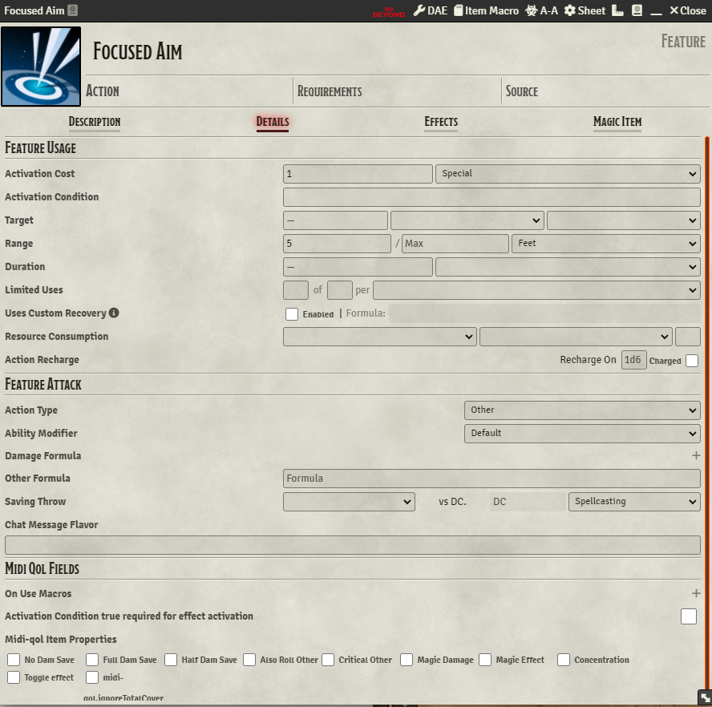
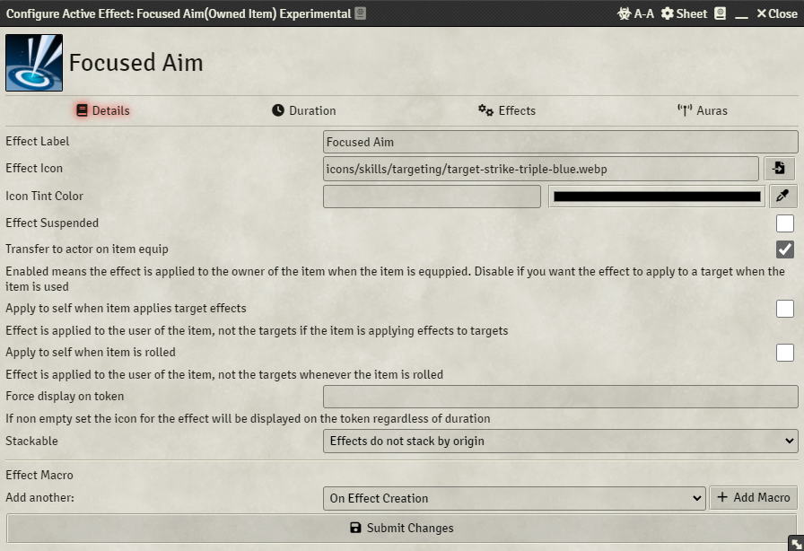
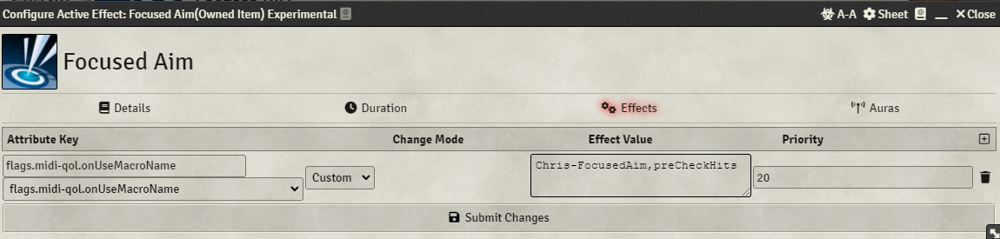

# Module Requirements  
Advanced Macros  
Dynamic Active Effects  
Midi-Qol (and it's own associated requirements)  
Warpgate  
# Macro Requirements  
Chris - Warpgate Menu Helper  
# Setup Instructions  
- Actor must have a feature called "Ki Points" that has uses.  
- Create a feature called "Focused Aim" and configure it as pictured below:  
  
  
  