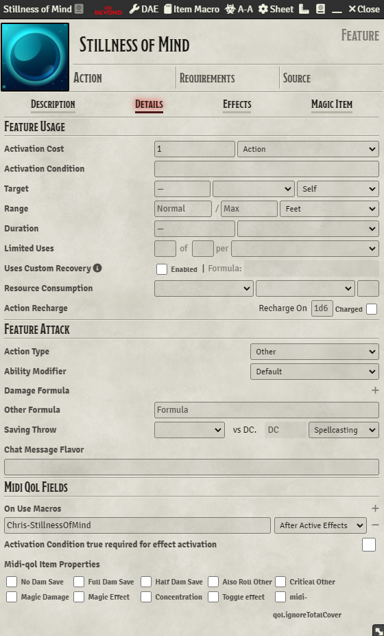

#Module Requirements
Advanced Macros
DFreds Convenient Effects
Midi-Qol (and it's own associated requirements)
Warpgate
#Macro Requirements
Chris - Warpgate Menu Helper
#Setup Instructions
- Add the macro as an Item Macro or a Hotbar Macro in the "On Use Macro" field with Midi-Qol.
- Configured the feature as pictured below:
