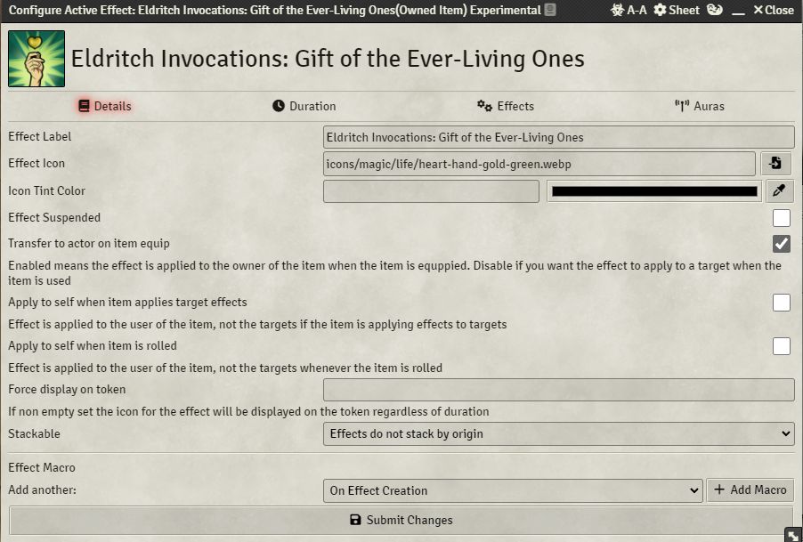
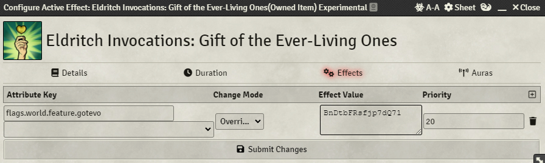

# Module Requirements  
Dynamic Active Effects  
Midi-Qol (and it's own associated requirements)  
World Scripter    
# Setup Instructions  
- Create a Hotbar Macro and paste in the macro.  
- Drag the created Hotbar Macro into the World Scripter "World Scripter Macros" compendium (You can delete the Hobat Macro after this).  
- Configure the "Eldritch Invocations: Gift of the Ever-Living Ones" feature to have an effect that applies the flag "flags.world.feature.gotevo" with an overwrite of the familiar's actor id.  See example below:  
  
  
# Notes  
This only applies to single target heals and does not work for healing that doesn't use Midi-Qol workflows (such as from using hit dice during a short rest).