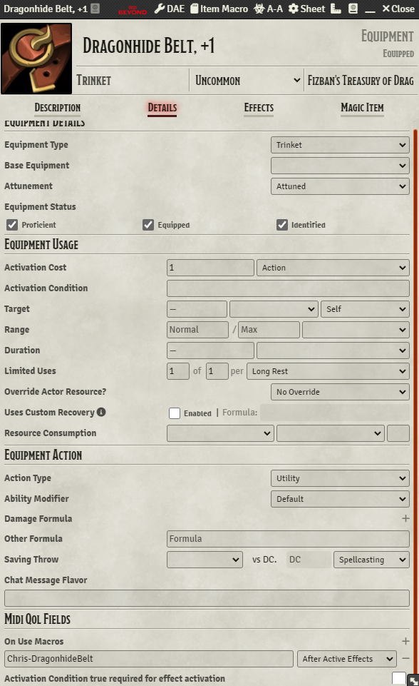
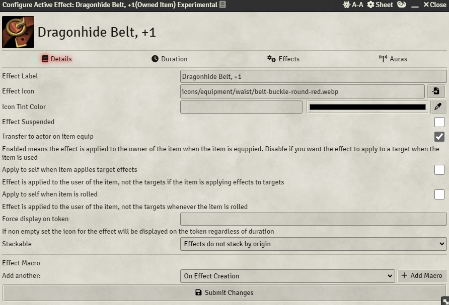
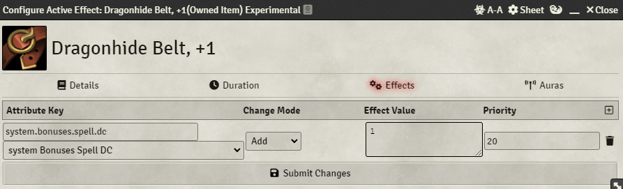

# Module Requirements  
Midi-Qol (and it's own associated requirements)  
# Setup Instructions  
- Actor must have a feature called "Ki Points" that has uses.  
- Actor must have a scale called "martial-arts" that is setup as the monk damage dice. If you use the DnDBeyond importer this is already done for you.  
- Add the macro as an Item Macro or a Hotbar Macro in the "On Use Macro" field with Midi-Qol.  
- Configured the item as pictured below:  
  
  
  