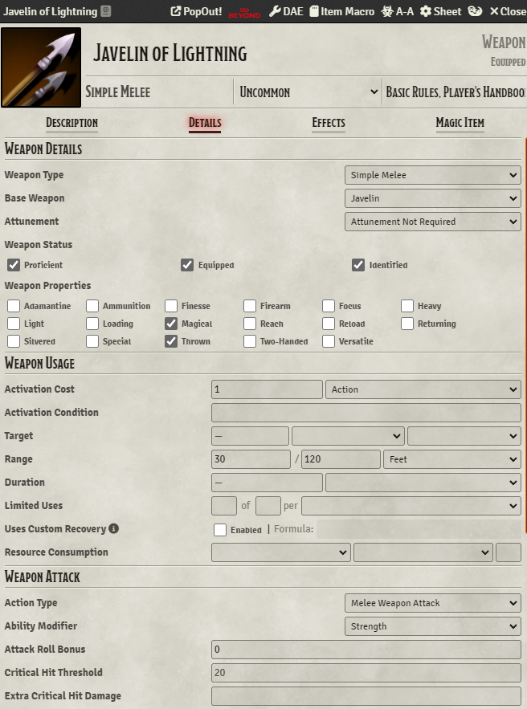
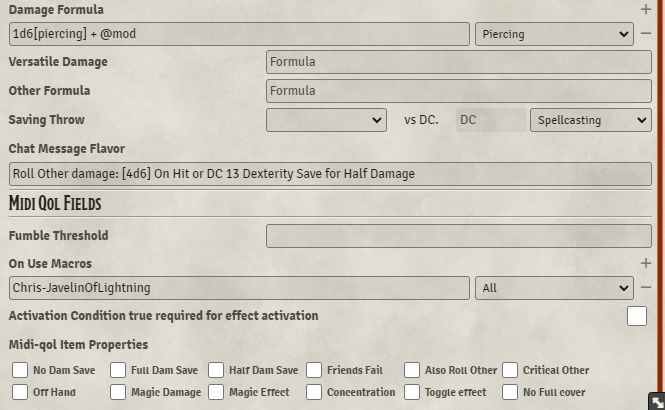

# Module Requirements  
Dynamic Active Effects  
Template Macros  
Midi-Qol (and it's own associated requirements)  
Template Macros  
Warpgate  
# Setup Instructions  
- Add the item macro and and configure as seen below:  
  
  