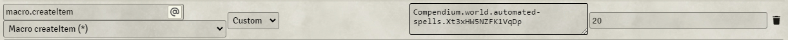

# Module Requirements  
Dynamic Active Effects  
Effect Macros    
Midi-Qol (and it's own associated requirements)  
Warpgate  
# Setup Instructions  
- Create the hotbar script macro for "Chris-Hex" and "Chris-HexMove".  
- Configure hex as pictured below:  
  
- Configure the DAE on it as pictured below:  
  
  
- Create a new feature in your items directory (or preferabbly a compendium) for the "Hex - Move" feature and configure it as pictured below:  
  
- Edit the Hex DAE to use the correct item uuid for the newly created "Hex - Move" uuid.  You can drag the feature from the sidebar or compendium into the value field to do this.  
