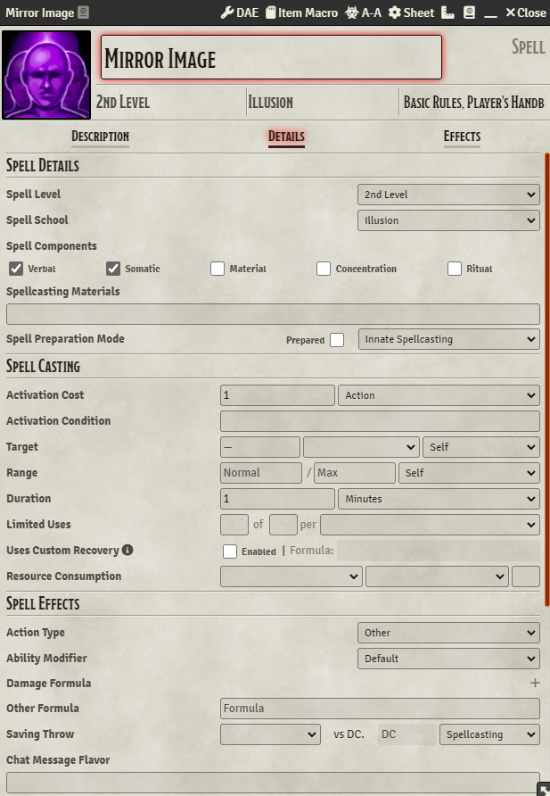
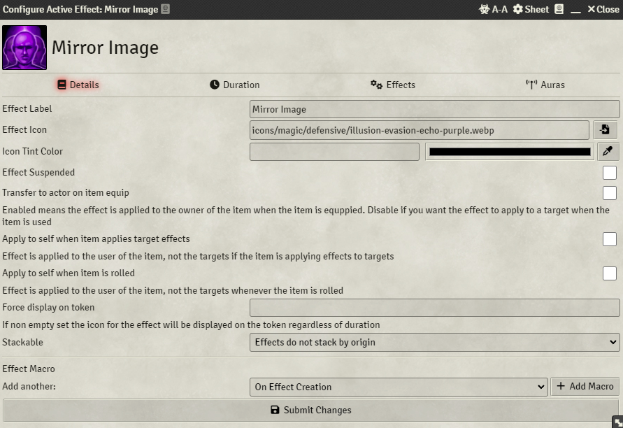

# Module Requirements  
Dynamic Active Effects  
Midi-Qol (and it's own associated requirements)  
World Scripter     
# Setup Instructions  
- Create a Hotbar Macro and paste in the macro.  
- Drag the created Hotbar Macro into the World Scripter "World Scripter Macros" compendium (You can delete the Hobat Macro after this).  
- Configure the Mirror Image spell as pictured below:  
  
  
  

