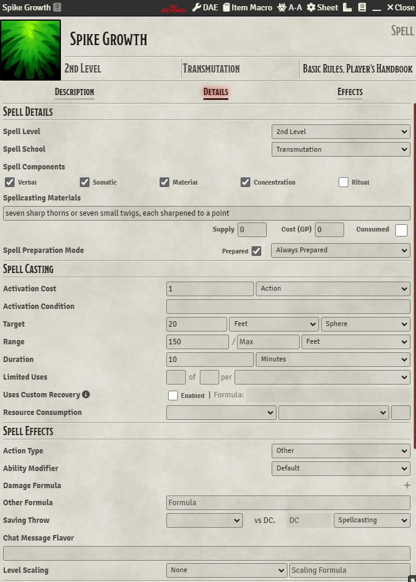
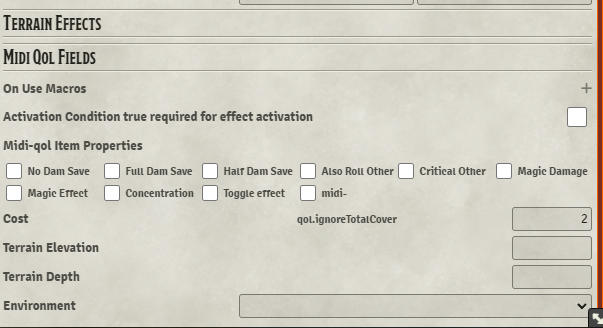

# Module Requirements  
Midi-Qol (and it's own associated requirements)  
Template Macros  
# Notes  
- Currently the token won't take damage if it passes through the template but does not stop in it. This is a limitation of template macros.  
- The scene must use "ft" as it's grid.  
# Setup Instructions  
- Copy and paste the macro from "TemplateWhenEnteredWhenLeft.js" into the "When Entered" and "When Left" field from template macros.  
- Copy and paste the macro from "TemplateWhenStaying.js" into the "When Staying" field from template macros.
- Configure the Spike Growth spell as pictured below:  
  
  